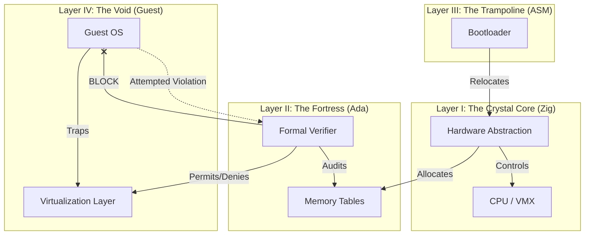
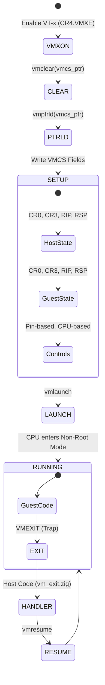

# Akashic Hypervisor


```text
      _    _               _     _      
     / \  | | ____ _ ___| |__ (_) ___ 
    / _ \ | |/ / _` / __| '_ \| |/ __|
   / ___ \|   < (_| \__ \ | | | | (__ 
  /_/   \_\_|\_\__,_|___/_| |_|_|\___|
                                      
  TYPE-1 VERIFIED MICROVISOR // AEGIS CORE ZERO
```

## 🌌 The Manifesto: Computational Metaphysics

**Akashic Hypervisor** is not just a piece of software; it is a rejection of the status quo in systems engineering. Modern Operating Systems (Linux, Windows) are monolithic towers of Babel—millions of lines of unsafe C code, holding together drivers, protocols, and file systems with nothing but hope and convention.

Akashic posits a different reality: **The Hypervisor as a Truth Engine.**

In this architecture, the Hypervisor does not "manage resources"; it enforces **Physics**. It defines the fundamental constants (Memory, Time, I/O) of the universe that the Guest OS inhabits. If the Hypervisor is mathematically proven to be correct, then the Guest OS cannot violate the laws of physics, no matter how compromised it becomes.

This project implements a **Vertical Kernel** architecture, fusing the raw, unsafe power of **Zig** (for hardware manipulation) with the rigorous, mathematical safety of **Ada/SPARK** (for logic verification), running on bare metal.

---

## 🧠 Architectural Mental Map

The system is designed as a hierarchy of strict dominance. Lower layers serve upper layers, but upper layers constrain lower layers.



### The Five Layers of Akashic

1.  **Layer I: The Crystal Core (Zig)**
    *   **Role:** The Body.
    *   **Language:** Zig (0.13.0).
    *   **Responsibility:** It touches the "dirty" reality of hardware. It manages the Physical Memory Manager (PMM), constructs the Extended Page Tables (EPT), and executes the VMX instructions (`vmxon`, `vmlaunch`). It is fast, unchecked, and powerful.
2.  **Layer II: The Fortress (Ada)**
    *   **Role:** The Conscience.
    *   **Language:** Ada 2022 (Zero Footprint Profile).
    *   **Responsibility:** It audits the body. Before the Core is allowed to execute `vmlaunch`, it must pass a pointer to the EPTs to the Fortress. The Fortress mathematically verifies that the memory map obeys the **Law of Isolation** (e.g., No W^X violations, No Kernel overlap).
3.  **Layer III: The Trampoline (ASM)**
    *   **Role:** The Bridge.
    *   **Language:** GNU Assembly (x86).
    *   **Responsibility:** A brute-force loader that forces the Multiboot header to the correct file offset, extracts the kernel payload from a raw binary blob, and jumps to the Zig entry point.
4.  **Layer IV: The Void (Guest)**
    *   **Role:** The Subject.
    *   **Language:** Raw Binary / Assembly.
    *   **Responsibility:** The entity being observed. In this MVP, it is a bare-metal payload that attempts to write to the serial port.
5.  **Layer V: The Law (Formal Logic)**
    *   **Role:** The Truth.
    *   **Language:** Lean 4 (Planned).
    *   **Responsibility:** The mathematical definition of "Fairness" and "Liveness" that the Scheduler must satisfy.

---

## 📐 Deep Dive: The Mathematics of Isolation

The core value proposition of Akashic is **Runtime Verification**. Unlike traditional hypervisors that trust their own allocators, Akashic treats its allocator as an "Untrusted Prover" and the Ada layer as a "Verifier."

### The Set Theory of Memory

Let $M$ be the set of all Physical Frames in the machine.
Let $K \subset M$ be the set of frames owned by the Hypervisor (Kernel).
Let $G \subset M$ be the set of frames accessible by the Guest.

The **Law of Integrity** states:
$$ K \cap G = \emptyset $$

(The intersection of Kernel memory and Guest memory must be the Empty Set).

### The Logic of W^X (Write XOR Execute)

For any page $p \in G$, let $W(p)$ be true if the page is Writable, and $X(p)$ be true if the page is Executable.

The **Law of Execution** states:
$$ \forall p \in G, \neg (W(p) \land X(p)) $$

(No page shall be both Writable and Executable). This prevents modern exploit techniques like Shellcode injection.

### Implementation in Ada

The `Fortress` package implements these checks by iterating over the raw bits of the Page Map Level 4 (PML4) entries.

```ada
--  simplified logic from src/fortress/fortress.adb
function Verify_Security (PML4_Addr : unsigned_long) return int is
begin
   --  Walk the Page Tables...
   if (Entry_Val and Write_Bit) /= 0 and then (Entry_Val and Exec_Bit) /= 0 then
       return 0; -- REJECT: W^X Violation
   end if;

   if (Entry_Val and Address_Mask) = Kernel_Base_Address then
       return -1; -- REJECT: Kernel Overlap
   end if;

   return 1; -- ACCEPT
end Verify_Security;
```

If this function returns anything other than `1`, the Zig Core enters a panic state and refuses to launch the VM. This architectural separation means that a bug in the Zig allocator (e.g., accidentally mapping a kernel page to the guest) becomes a **Safety Failure** (System Halt), not a **Security Failure** (Exploit).

---

## ⚙️ The VMX Lifecycle (Virtualization Logic)

Akashic implements the Intel VT-x lifecycle manually. This is the state machine of the processor as managed by `src/kernel.zig` and `src/vm_runner.S`.



### The VMCS (Virtual Machine Control Structure)

The VMCS is a 4KB region of memory that acts as the configuration file for the vCPU. Akashic manually populates this structure. Key fields managed in `src/kernel.zig`:

| Field | Value | Purpose |
| :--- | :--- | :--- |
| **GUEST_RIP** | `0x200000` | The entry point of the guest payload. |
| **HOST_RIP** | `vm_exit_handler` | Where the CPU jumps when the guest crashes or traps. |
| **EPT_PTR** | `&pml4` | Pointer to the Verified Page Tables. |
| **PIN_CONTROLS** | `0x...` | Asynchronous event handling (Interrupts). |

---

## 🏗 The Build System: A "Frankenstein" Engineering Feat

One of the most complex aspects of Akashic is its build system (`build_kernel.sh`). Linking High-Level languages like Zig and Ada into a freestanding binary is non-trivial due to conflicting runtimes and linker expectations.

### The Problem: Multiboot Alignment
The Multiboot specification requires a "Magic Header" to be present in the first 8KB of the binary. Modern linkers (`ld.lld`) often shuffle sections for optimization, pushing the header out of the scan window, rendering the kernel unbootable by QEMU/GRUB.

### The Solution: The Trampoline Strategy
We utilize a custom assembly loader (`trampoline.S`) that acts as a wrapper around the kernel.

1.  **Compile Payload:** Zig and Ada are compiled and linked into an ELF binary (`payload.elf`) linked at `2MB`.
2.  **Extract Binary:** We strip all ELF headers, leaving a raw binary blob (`kernel.bin`).
3.  **Embed:** `trampoline.S` uses the `.incbin` directive to physically paste `kernel.bin` into its own data section.
4.  **Force Header:** `trampoline.S` defines the Multiboot header in its `.text` section, guaranteeing it appears at byte offset `0x1000`.
5.  **Jump:** The trampoline bootstraps the CPU, switches stacks, and jumps to the blob at `2MB`.

```text
Physical Memory Map
+---------------------+ 0x000000
| BIOS / Real Mode    |
+---------------------+ 0x100000 (1MB)
| Trampoline (ASM)    | <--- Bootloader enters here
| Multiboot Header    |
+---------------------+
|                     |
| ... gap ...         |
|                     |
+---------------------+ 0x200000 (2MB)
| Akashic Kernel      | <--- Trampoline jumps here
| (Zig + Ada)         |
+---------------------+
| Guest Payload       | <--- Loaded by Kernel
+---------------------+
```

---

## 🖥 Usage Guide

### Prerequisites
To build Akashic, you need a Linux environment with:
*   **Zig 0.13.0** (Compiler)
*   **GNAT** (Ada Compiler, part of `gcc-ada`)
*   **QEMU** (`qemu-system-x86_64`)
*   **Binutils** (`as`, `ld`, `objcopy`)

### Building the Kernel
The build script handles the multi-stage compilation, linking, and packaging.

```bash
./build_kernel.sh
```

*Success Indicator:* Look for `SUCCESS: Kernel is Multiboot compliant.` at the end of the log.

### Running the Hypervisor
This command launches QEMU with the kernel and the guest payload (`guest.bin`) passed as an initrd module.

```bash
./run_qemu.sh
```

**Expected Output:**
```text
Akashic Hypervisor (Verified Loader) v0.3
-----------------------------------------
[BOOT] Multiboot Info at 0x9500
[LOAD] Found Module at 0x10A000 (Size: 16 bytes)
[LOAD] Guest Relocated to 0x200000
[SAFE] Memory Maps Verified.
[VMX]  Launching Guest at 0x200000...
```
*(Note: If running in a simulation without nested virt, it may stop after verification).*

---

## 🔮 Roadmap to v1.0

The current version is **v0.3 (Prototype)**. The path to a production-grade Security Microvisor involves:

*   **Phase I: Linux Loader** - Replace the raw binary loader with a `bzImage` parser to boot a standard Linux kernel as a guest.
*   **Phase II: Hardware Passthrough** - Implement IOMMU support to safely assign PCI devices (NICs, NVMe) directly to the guest.
*   **Phase III: Introspection** - Implement the **Tensor Eye** (Layer III), a BQN-based engine that analyzes guest memory in real-time to detect rootkits.

## 📜 License

This project is open-source under the **MIT License**.

**"Quis custodiet ipsos custodes?"**
*Who watches the watchmen?*
**Akashic does.**